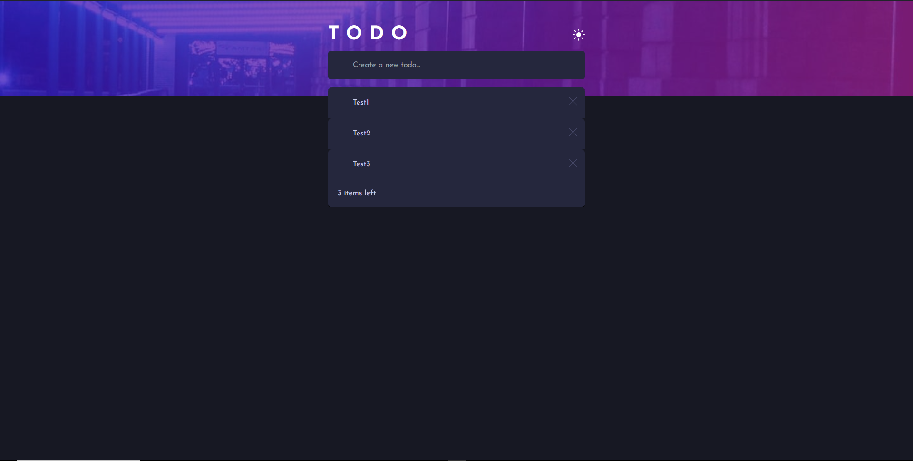

# MERN-Todo-App

  

# About

This is my first MERN project - "Todo App" with React, Typescript, Tailwind, Framer-Motion, NodeJS, Express, MongoDB

# Getting Started


1. First of all you need to clone app repository from github:

```
https://github.com/Lazzzare/FullStack-TodoApp
```

2. Next step requires install all the dependencies.

```
npm install
```

3. Next step requires open front-end folder.

```
cd frontend
npm run dev
```

4. Next step requires open back-end folder.

```
cd backend
npm run dev
```

# Link

- Live Site URL: [Live Site](https://full-stack-todo-app-silk.vercel.app/)

# Built With

- _Vite_
- _React_
- _Typescript (TSX)_
- _TailwindCss_
- _React Hooks (useState, useEffect)_
- _framer-motion_
- _NodeJS_
- _Express_
- _MongoDB_
